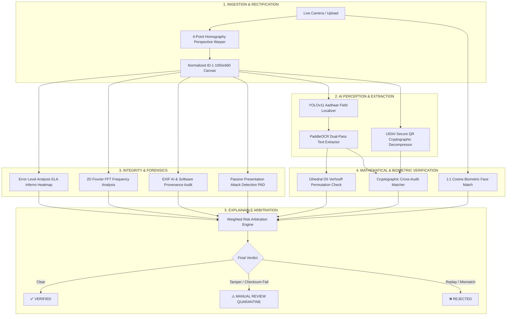

# 🛡️ IDGUARD — AI-Powered Automated Identity Verification & Forensic Integrity System

[](https://opensource.org/licenses/MIT)
[](https://fastapi.tiangolo.com)
[](https://react.dev)
[](https://vitejs.dev)
[](https://tailwindcss.com)
[](https://github.com/ultralytics/ultralytics)
[](https://vercel.com/new/clone?repository-url=https://github.com/kartikverma-dev/IDGUARD)

> **Smart India Hackathon (SIH 2026)**  
> **Problem Domain**: Automated Fraud-Resilient KYC, Document Splicing Forensics & Biometric Identity Verification.

---

## 🌟 Overview

**IDGUARD** is an enterprise-grade, multi-stage identity document verification and digital forensics platform. It moves beyond naive optical character recognition by triangulating **deep learning object detection**, **mathematical dihedral group checksums**, **cryptographic QR payload cross-auditing**, and **multi-factor pixel-level tampering forensics**.



---

## 🚀 Key Technological Innovations

### 1. Automated 4-Point Homography Perspective Rectifier
- Automatically detects card contours in mobile smartphone captures, orders convex vertices clockwise, and computes the perspective transform matrix (`cv2.getPerspectiveTransform`) to warp tilted cards into a flat $1050 \times 660$ ID-1 aspect ratio.

### 2. Custom YOLO Document Field Localizer (`models/best.pt`)
- Proprietary trained YOLO model (5.35 MB) trained on multi-layout Aadhaar datasets to localize critical identity regions:
  - `Aadhaar_Number`
  - `Name`
  - `DOB`
  - `Gender`
  - `Address`

### 3. Dihedral Group $D_5$ (Verhoeff) Permutation Algorithm
- Performs strict modular mathematical checksum validation on the 12-digit Aadhaar number before making any external calls. Fabricated or mistyped Aadhaar numbers are immediately caught in $< 1 \text{ ms}$.

### 4. Cryptographic Secure QR Code Decompressor & Cross-Audit
- Decompresses modern 2048-bit RSA encrypted Secure QR codes (V2/V3) using `zlib.decompress` alongside legacy XML V1 codes.
- Extracts digitally signed demographic fields and cross-checks them against the printed OCR text to catch **swapped credential attacks** (e.g. pasted names or cloned QR matrices).

### 5. Multi-Factor Splicing & Forgery Forensics
- **Error Level Analysis (ELA)**: Recompresses at 90% JPEG quality to reveal modified, cloned, or pasted pixel blocks, visualized through an interactive **Inferno Colormap Heatmap**.
- **2D Fourier FFT Spectrum Analysis**: Detects high-frequency periodic lattice patterns typical of screen displays and color laser printer moiré.
- **EXIF & Metadata Provenance**: Audits image headers for Photoshop, Canva, GIMP, or synthetic AI generative tags.

### 6. Passive Presentation Attack Detection (PAD)
- Evaluates texture micro-roughness (Laplacian dispersion), specular glare reflections, and chromatic saturation to detect physical paper cutouts and smartphone replay spoofing without requiring bulky WebRTC streaming.

---

## 🌐 Web Deployment Guide (Vercel + Cloud Backend)

### Part 1: Deploy Frontend to Vercel (Automatic CI/CD)

1. Go to [Vercel.com](https://vercel.com) and log in with your GitHub account.
2. Click **"Add New..."** &rarr; **"Project"**.
3. Import your repository: **`kartikverma-dev/IDGUARD`**.
4. In the **Configure Project** screen:
   - **Framework Preset**: `Vite`
   - **Root Directory**: `./` (or select `frontend` if deploying frontend alone)
   - **Build Command**: `cd frontend && npm install && npm run build` (handled automatically by `vercel.json`)
   - **Output Directory**: `frontend/dist`
5. Under **Environment Variables**, add:
   ```env
   VITE_API_BASE_URL = https://your-backend-url.onrender.com
   ```
   *(If your backend is not deployed yet, leave it empty; the app will default to local or allow live backend configuration in Settings)*.
6. Click **Deploy**. Vercel will build and deploy your app in $< 1$ minute!

> **Note**: IDGUARD includes root and subfolder `vercel.json` files with SPA rewrite rules (`/(.*) -> /index.html`) so refreshing routes like `/verify` or `/history` will never result in 404 errors.

---

### Part 2: Deploy Backend to Cloud (Render / Railway / Hugging Face)

Because the backend relies on heavy machine learning packages (`torch`, `ultralytics`, `paddlepaddle` total > 2.5 GB), it is hosted as a persistent container service:

#### Option A: 1-Click Render.com Deployment
1. Log in to [Render.com](https://render.com).
2. Click **"New +"** &rarr; **"Web Service"** &rarr; Connect `kartikverma-dev/IDGUARD`.
3. Set:
   - **Root Directory**: `backend`
   - **Environment**: `Python 3`
   - **Build Command**: `pip install -r requirements.txt`
   - **Start Command**: `uvicorn main:app --host 0.0.0.0 --port $PORT`
4. Click **Create Web Service**. Copy the provided URL (e.g. `https://idguard-backend.onrender.com`) and paste it into your Vercel `VITE_API_BASE_URL`.

#### Option B: Docker Container Deployment
A production `Dockerfile` is included in `backend/Dockerfile`. You can deploy this image to **Railway**, **Koyeb**, or **AWS ECS**:
```bash
docker build -t idguard-backend ./backend
docker run -p 8000:8000 idguard-backend
```

---

## 💻 Local Development Quickstart

### Prerequisites
- Python 3.9 - 3.11
- Node.js 18+ (Optional if using pre-built bundle)

### 1. Run Backend
```bash
cd backend
python -m venv venv
# Windows:
venv\Scripts\activate
# Linux/Mac:
source venv/bin/activate

pip install -r requirements.txt
uvicorn main:app --reload --host 0.0.0.0 --port 8000
```
- Interactive Swagger API Docs: `http://127.0.0.1:8000/docs`

### 2. Run Frontend
```bash
cd frontend
npm install
npm run dev -- --port 3000
```
- Open in browser: `http://localhost:3000`

---

## 📁 Repository Structure

```text
IDGUARD/
├── backend/
│   ├── api/                 # FastAPI routes (health, verification, demo assets)
│   ├── models/              # YOLO model weights (best.pt)
│   ├── schemas/             # Pydantic data contracts
│   ├── services/            # Core processing microservices
│   │   ├── document_detector.py  # YOLO field localizer
│   │   ├── perspective_warper.py # 4-point homography deskewer
│   │   ├── ocr_service.py        # PaddleOCR dual-pass engine
│   │   ├── aadhaar_qr_service.py # Cryptographic secure QR decompressor
│   │   ├── forgery_service.py    # ELA, FFT, and EXIF analyzer
│   │   ├── liveness_service.py   # Passive PAD anti-spoofing
│   │   ├── face_service.py       # 1:1 Cosine biometric matching
│   │   └── risk_engine.py        # Weighted arbitration engine
│   ├── Dockerfile           # Production container configuration
│   ├── requirements.txt     # Python backend dependencies
│   └── main.py              # Application entrypoint & static mounting
├── frontend/
│   ├── src/
│   │   ├── config/api.ts    # Centralized dynamic API client
│   │   ├── pages/           # Dashboard, Verify, Result, History, Pipeline, Settings
│   │   ├── components/      # Reusable UI widgets & camera viewfinders
│   │   └── types/           # TypeScript data interfaces
│   ├── package.json
│   ├── vite.config.ts
│   └── vercel.json          # SPA rewrite rules
├── models/
│   └── best.pt              # Custom trained YOLO Aadhaar field detector (5.35 MB)
├── vercel.json              # Root Vercel build & SPA configuration
├── render.yaml              # Render blueprint for cloud backend
├── IDGUARD_MASTER_DOCUMENTATION.md # Technical reference manual
├── QUICKSTART.md            # Fast run guide
└── README.md                # Project documentation
```

---

## 👥 Authors & Acknowledgments

- **Lead Developer**: Kartik Verma ([@kartikverma-dev](https://github.com/kartikverma-dev))
- **Team**: Smart India Hackathon (SIH 2026) Finalists
- **License**: [MIT License](LICENSE)
